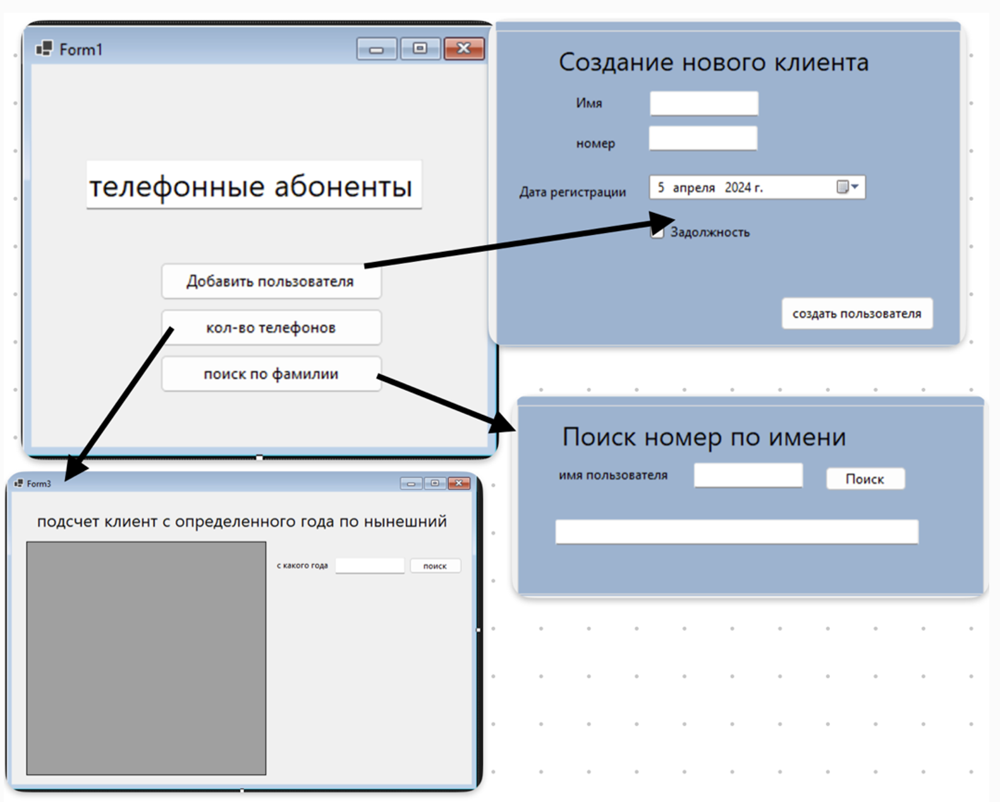

# Order Management & Phone Subscriber Systems

This repository contains two separate Windows Forms applications developed using .NET. The first system is for managing customer orders, and the second is for maintaining a database of phone subscribers.

---

## 📦 Project 1: Order Management System

### 🧾 Description

An application for managing customers, products, and orders. It allows users to create orders, add products, and manage client information via a graphical interface.

### 🎯 Features

- **Customer Management**:  
  - Add new clients (name, address, city, state, postal code)
- **Product Management**:  
  - Add products (name, price, available quantity)  
  - View product list
- **Order Management**:  
  - Create new orders  
  - Add multiple products to an order  
  - View all orders (completed or pending)  
  - Edit order details

### 🗃️ Database Schema (MySQL)

#### `product` table

| Field       | Type        | Description                    |
|-------------|-------------|--------------------------------|
| product_id  | INT (PK)    | Unique product ID              |
| name        | VARCHAR     | Product name                   |
| price       | DECIMAL     | Product price                  |
| quantity    | INT         | Available stock                |

#### `client` table

| Field        | Type        | Description              |
|--------------|-------------|--------------------------|
| client_id    | INT (PK)    | Unique client ID         |
| name         | VARCHAR     | Client name (unique)     |
| address      | VARCHAR     | Client address           |
| city         | VARCHAR     | City                     |
| state        | VARCHAR     | State/Region             |
| postal_code  | VARCHAR     | Postal code              |

#### `orders` table

| Field        | Type        | Description                    |
|--------------|-------------|--------------------------------|
| order_id     | INT (PK)    | Unique order ID                |
| client_id    | INT (FK)    | Linked client ID               |
| status       | BOOLEAN     | Order status (true = done)     |
| num_product  | INT         | Number of products in order    |

#### `order_product` table

| Field        | Type        | Description                    |
|--------------|-------------|--------------------------------|
| order_id     | INT (FK)    | Linked order ID                |
| product_id   | INT (FK)    | Linked product ID              |
| quantity     | INT         | Quantity of product ordered    |

### 🖥️ User Interface

Developed using **Windows Forms** with features such as:
- Dropdowns for selecting clients and products
- Basket memory for incomplete orders
- Separate forms for managing clients and viewing order history

## 📄 Forms Overview

This section provides a brief description of each user interface form included in both systems.

---

### 🧾 Order Management System Forms

#### 📋 Order Form
- Select an existing client from a dropdown list.
- Choose items from the menu and specify quantity.
- If a client previously added items to the cart but didn’t complete the order, the cart is restored when returning.
- Calculates the total amount for the order.

#### 👤 Client Creation Form
- Used to add a new client.
- All fields are required: name, address, city, state, and postal code.
- The name must be unique.
- Validation checks for empty fields.

#### 📜 Order History Form
- Displays all orders created in the system.
- Separates completed and pending orders.
- Allows reviewing details of each order.

## ⚙️ Technologies Used

- **Platform**: .NET Framework
- **Language**: Visual Basic (VB.NET)
- **Database**: MySQL / SQL Server
- **UI Framework**: Windows Forms
- **Data Access**: ADO.NET
- **Version Control**: Git (TortoiseGit)

---

## 📚 What I Learned

- Setting up and working with relational databases
- Designing multi-form Windows Forms applications
- Version control using Git and GitHub
- Structuring database-driven applications in VB.NET

---

## 🧑‍💻 Author

Created by wikpza as part of coursework on software development and database systems.

---

## 📜 License

This project is educational and not intended for production use. License can be added if needed.

